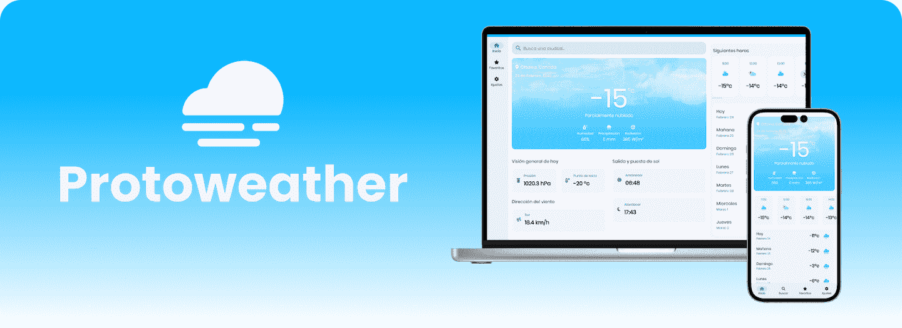

# Protoweather

Aplicación web para consultar el pronostico del tiempo hecha con Angular.

[Demo](https://protoweather.vercel.app/)

## Características

* Consulta el clima
* Almacena ciudad predeterminada
* Almacena ciudades favoritas
* Fondo animado que cambia de acuerdo a la hora y clima
* Diseño responsive
* SSR

## TODO

💡 Fondo animado para tormenta y nieve.

💡 Poder ver las ciudades favoritas desde la pagina de inicio.

💡 Implementar PWA.

💡 Implementar localización.

💡 Agregar más elementos a la pagina de inicio.

💡 Agregar descripción de los terminos metereológicos en la pagina de inicio.

💡 Implementar testing.

## Angular

Run `ng serve` for a dev server. Navigate to `http://localhost:4200/`. The application will automatically reload if you change any of the source files.

Run `ng generate component component-name` to generate a new component. You can also use `ng generate directive|pipe|service|class|guard|interface|enum|module`.

## Build

Run `ng build` to build the project. The build artifacts will be stored in the `dist/` directory.

## Running unit tests

Run `ng test` to execute the unit tests via [Karma](https://karma-runner.github.io).

## Running end-to-end tests

Run `ng e2e` to execute the end-to-end tests via a platform of your choice. To use this command, you need to first add a package that implements end-to-end testing capabilities.

## Further help

To get more help on the Angular CLI use `ng help` or go check out the [Angular CLI Overview and Command Reference](https://angular.io/cli) page.
